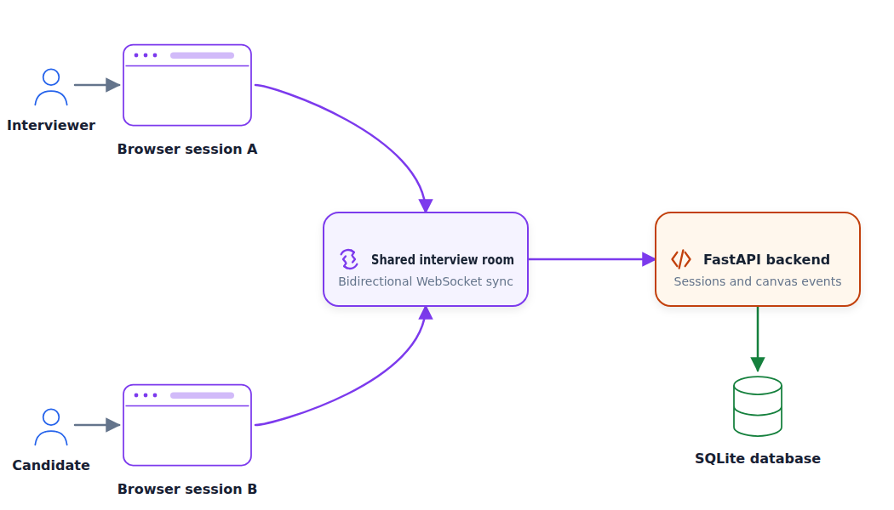
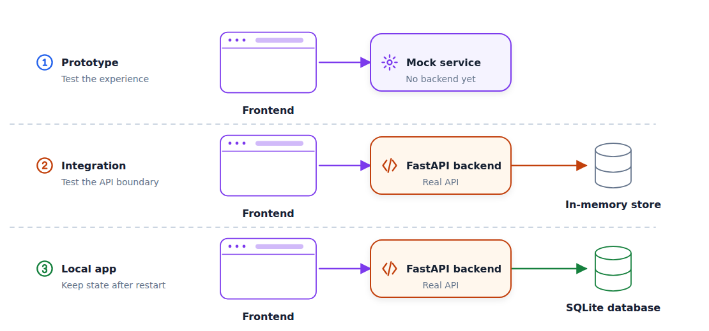
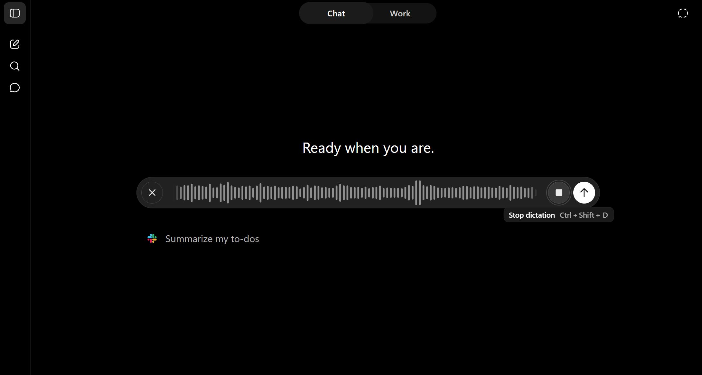
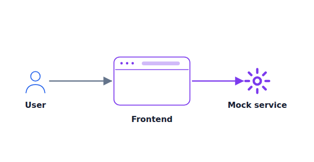
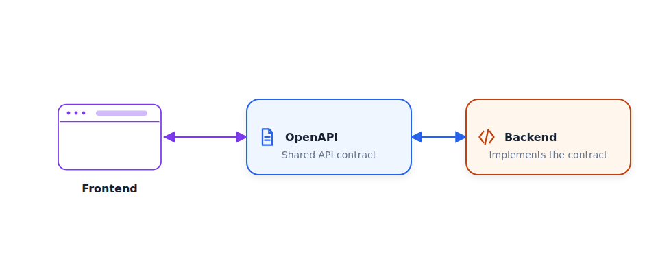
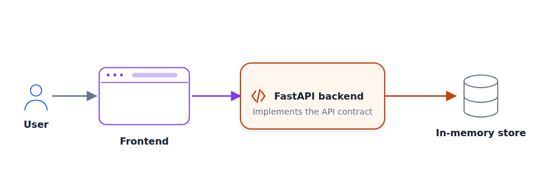

# Build and Ship a Full-Stack App with AI Coding Assistants

This is the second article in a series for [AI Dev Tools Zoomcamp](https://github.com/DataTalksClub/ai-dev-tools-zoomcamp), the free course we run at DataTalks.Club.

In the [first article](https://aishippingblog.com/p/ai-native-development-specifications), I wrote about turning an idea into a specification. The specification is only the beginning. In this article, we will create an end-to-end application from scratch. We will cover both frontend and backend, add a database, and get the application working locally.

We will create an application for system-design interviews.

As an interviewer, you create a session and share the link with the interviewee. They can create diagrams in the app, and you see the changes in real time.

Both frontends connect to the same room through WebSockets, so the changes appear
in both sessions simulataneously.
The FastAPI backend handles those events and saves them to SQLite.

<figure>
  
  <figcaption>Two browser sessions collaborate through one WebSocket-backed interview room</figcaption>
</figure>


You can find the code in the [interview-canvas-share](https://github.com/alexeygrigorev/interview-canvas-share) repository.

It's based on my full-day workshop I did for AI Shipping Labs:
[Build and Deploy a Full-Stack App with AI Coding Assistants](https://aishippinglabs.com/workshops/full-stack-vibe-coding).


## Overview

Like in the [previous article](https://aishippingblog.com/p/ai-native-development-specifications), we start with an idea. As this is only
an idea, we turn it into a specification using ChatGPT.

From there, we start building:

1. Generate a frontend that uses mocked backend calls.
2. Establish backend-fronend contract by creating OpenAPI specifications from the frontend service layer.
3. Implement the FastAPI backend, connect it to the frontend, and test the application.
4. Add persistence with SQLite and SQLAlchemy.

At each stage we get something concrete that we can test:

- First we define the specication and make sure it refects what we want to build.
- After that, we use the specs to create a frontend prototype that we can interact with. We mock backend calls so we can test the idea.
- Then we connect the frontend to the backend. We start with an in-memory store
  to make sure the frontend-backend connection works.
- Finally, we add a database so the application keeps its state after a restart.

At the end, we have a working local application that is ready for deployment.

<figure>
  
  <figcaption>The interfaces stay stable while temporary components are replaced one at a time</figcaption>
</figure>


## Start with a specification

Before building the frontend, we need to describe the application precisely. If we don't do it, we will get something that works but we don't need.

For our application, we need to specify:

- who creates an interview session
- how a candidate joins it
- which components they can place on the canvas
- how both people see changes in real time

This is called "Specification-Driven Development". We don't spend a lot of time here because it was the focus of the previous article [AI-Native Development: Specifications, Loop and Graph Engineering](https://aishippingblog.com/p/ai-native-development-specifications).

For creating the specification, I always use ChatGPT in dictation mode. Give the assistant as much information as possible at this stage.

<figure>
  
  <figcaption>Dictating the initial application idea to ChatGPT</figcaption>
</figure>

You can see the result [here](https://github.com/alexeygrigorev/interview-canvas-share/blob/main/docs/spec.md).


## Frontend first

Now we have the specification, but it's only text. There are multiple options of what you can do next:

- Focus on the database layer, define the entities, and work all the way up through backend to frontend
- Alternatively, you can start with speficying OpenAPI and define how backend and frontend interact and build both independently from there
- Or you can focus on the frontend first and then build the rest

All these approaches make sense and have their pros and cons.

For simple projects that you're building alone, I recommend starting with frontend. You can quickly judge if you're moving in the right direction, and if this can solve your problem or not.

Treat it as a way to test your idea and your specification, and do it before you build the rest of the application. 

For this step I use [Lovable](https://lovable.dev/), which generates a React app from
one prompt. Replit, v0, and Bolt are similar tools that you can use too.

Alternatively, you can start with coding assistants directly and ask them to create a React app (or whatever technology you want).

I use Lovable because it creates really nice designs. Also, I'm not a frontend engineer and I don't know much about the frontend world. Lovable makes technology choices for me that I know will make sense, while a coding agent can select something arbitrary.

Now open any tool of your choice and give it this prompt:


```text
Create a system design interview application. 

[Paste the ChatGPT-generated specification here.]

Centralize every backend call in one services layer, and create a mock
implementation of it so the whole app runs without a real backend.

Add tests.
```

This part is quite important:

> Centralize every backend call in one services layer, and create a mock
> implementation of it so the whole app runs without a real backend.

Without it, the agent can do something arbirary, but here we explicitly say that we
want a mock service. Later, it will become the single point of integration of our frontend with backend. And because we mock it, it will work from the beginning.

<figure>
  
  <figcaption>The frontend is real and interactive; only its backend service is mocked</figcaption>
</figure>

Lovable creates a React app in TypeScript. We can interact with it in the Lovable interface. 

Next, save it to GitHub. If you use Lovable:

- Select the plus icon in the bottom-left corner
- Connect your GitHub account.
- Lovable creates a private repository. I usually change it to public.


## Move the frontend into the project

Next, we can clone the repository locally. For the rest of the project, I want this setup:

```text
/backend     # backend application and its tests
/docs        # supporting documentation
/frontend    # frontend application
AGENTS.md    # instructions for coding agents
openapi.yaml # API agreement
```

So let's create these folders and move all the frontend stuff to "frontend", and the specification we created to "/docs/spec.md".

After we re-arranged the files, commit the changes.

At this point, you should also run the application locally and test that things work
the way you want. If they don't, use a coding agent to fix it.

To run a project you exported from Lovable:

```bash
cd frontend
npm i
npm run dev
```

## AGENTS.md

We already discussed the importance of `AGENTS.md` in the first article.

Let's create one for this project too. Place it in the repository root:

```text
for backend, use uv for dependency management. a few useful commands:

uv sync
uv add <PACKAGE-NAME>
uv run python <PYTHON-FILE>

regularly commit code to git
```

## OpenAPI Specifications

When creating frontend, we asked the AI assistant to put everything in a centralized 
service layer. Later we will replace it with actual calls to backend.

But now we should define the specification - the agreement between frontend and backend. We will use [OpenAPI](https://learn.openapis.org/introduction.html) for that.

This specification gives explicit information about the endpoints, paths, request bodies, response bodies, and authentication rules.

<figure>
  
  <figcaption>OpenAPI is the explicit contract shared by the frontend and backend</figcaption>
</figure>

Let's create it:

```text
Read the frontend's API client in frontend/

Create openapi.yaml at the repository root.

Specify the backend this frontend expects:
every endpoint, method, path, request body, response body, and which
endpoints need authentication.
```

You can skip this step. But I wouldn't recommend it.

It takes a few minutes, but has many benefits.

The backend gets a precise target instead of being inferred from
frontend code. Not only we save tokens this way, but also get a clear 
picture of what exactly the backend needs.

You can see the resulting [openapi.yaml](https://github.com/alexeygrigorev/interview-canvas-share/blob/main/openapi.yaml).


## The Backend

Now we have the OpenAPI specs and we can use this file to create the backend. We will use Python and FastAPI for that.

When I start with frontend, I use a mocked backend and then replace it with a real one. In the same way, for FastAPI backends, I start with a mocked database, and then later change it.

I do that because I want to make sure the frontend-backend connection works, and until it's smooth, I don't worry about the persistance. 

Let's ask the coding assitant to implement it:

```text
Build a FastAPI backend in backend/ that implements the openapi.yaml spec.
Use an in-memory store and seed it with data so the frontend has something to show.
Add authentication with hashed passwords and bearer tokens for the endpoints
that need it.
Split the code into modules - routers, models, store, auth
Write tests
```

## Makefile

When it's ready, you can run the application. Normally, for FastAPI, the command is something like that:

```bash
cd backend
uv run uvicorn backend.main:app --reload --port 8091
```

I'll use port 8091 but you can replace it with any other port you like.

But for me it's always hard to remember these commands, so I ask the coding assistant to create a Makefile:

```text
Create a Makefile so I can easily run it.
```

Then running it is as simple as 

```bash
make run
```

When it's running, open http://localhost:8091/docs in the browser. You will see the 
OpenAPI specification of the implemented backend.

We can compare it with the actual specs. From this point we no longer need the original `openapi.yaml` - the one that's generated by FastAPI is enough.


## Connecting Frontend and Backend

Now when we have a running backend, we can connect it to the frontend:

```text
Switch the frontend to use the real backend client. 
```

<figure>
  
  <figcaption>Connect the real frontend and backend while keeping persistence mocked</figcaption>
</figure>

It most likely won't work from the first try. You will hist CORS errors and probably some others. 

It's also time to test the application thoroughly. Open two browser windows:

- Createa session in one and get the join link
- Use the join link in the second window 
- Interact with the system in the second window and see the changes being propagated to the first one.

If something doesn't work, ask the agent to fix it.

## Database

At this point we have a working application with frontend and backend. They can connect to each other. But because we don't have a real database yet, when the backend is restarted, all the data is lost. 

Let's fix it:

```text
Replace the in-memory store with a database. Use SQLite and SQLAlchemy
Use an environment variable to configure which DB the server should connect to
Make it database-agnostic - later we will add support for other databases (e.g. postgres)
```

<figure>
  
  <figcaption>SQLite replaces the in-memory store without changing the rest of the application flow</figcaption>
</figure>

There are a few important parts in this prompt:

- First, I ask it to use SQLite. It's a very nice and lightweight database for testing the application locally.
- At some point, you'll want to switch to a different database for production, e.g. Postgres. Using SQLAlchemy makes this process very simple.
- But we also mention that explicitly so the agent doesn't use any SQLite specific features in the first version.  


## Ready for deployment

Now we have a working application:

- we turned an idea into a specification,
- created frontend
- defined the API contract
- implemented the backend from the contract
- connected them 
- added SQLite for persistence


But this application is only working locally. Next, we need to deploy it. 
That's something we will do in the next article. We will take what we developed here and turn it into a deployed service.

We will:

- containerize the frontend and backend
- add integration tests for the full application flow
- set up CI to run the checks automatically
- run Postgres with Docker Compose
- add database migrations
- deploy the application to a public environment
- set up CD to deploy changes after the checks pass

## Step-by-Step Approach

In this workshop, we created a working application using the step-by-step approach.
At the end of each step, we had something funcioning:

- Clear spefication
- Working frontend prototype with mock backend
- Properly integrated backend with mock database
- Proper persistant with SQL

For each step, we started from a new session and drove the agent 
to produce a working version.

But we did it one prompt at a time. After the first version is working,
it's time to introduce the development process. 
We talked about it in the [first article](https://aishippingblog.com/p/ai-native-development-specifications). This process will help you application
continue working properly as it grows bigger.

## Next in the series

The remaining modules build on the same app:

- Deployment 
- DevOps and Observability

You can find the entire course in [the course repository](https://github.com/DataTalksClub/ai-dev-tools-zoomcamp). It's free.

This article is based on the the workshop I did for AI Shipping Labs:
[Build and Deploy a Full-Stack App with AI Coding Assistants](https://aishippinglabs.com/workshops/full-stack-vibe-coding). In that workshop I created the snake game, deployed it with AWS and configured CI/CD to make sure tests run on every push. Check it out! 
