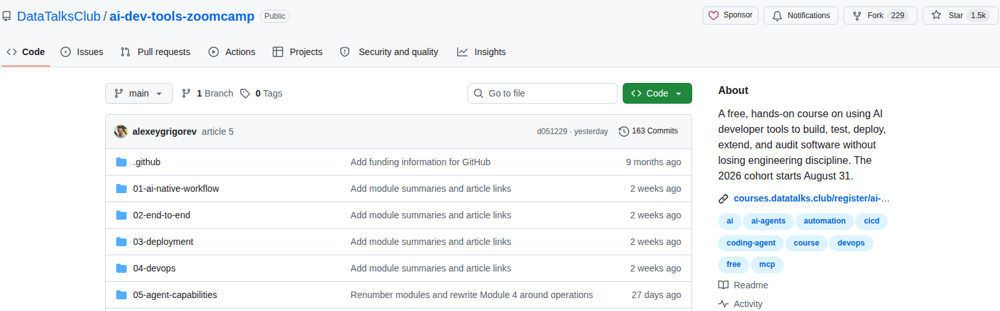

# Creating Cropped Web Screenshots for Articles

Article screenshots should show the part of a page that supports the surrounding text. A full browser window usually adds navigation, blank space, and unrelated content. Capture the page at a controlled size, then keep only the relevant panel.

Follow the same sequence for every screenshot:

1. Introduce the subject in the article.
2. Capture the rendered page without browser chrome.
3. Crop the image to the evidence the reader needs, keeping a comfortable margin around it.
4. Save it under `articles/images/` with the article-number prefix.
5. Insert a `<figure>` immediately after the text it supports.
6. Add descriptive alt text and a separate takeaway in `<figcaption>`.

We use headless Chromium for page capture and ImageMagick or Playwright for cropping.

## Install the tools

You need:

- Chromium or Chrome
- ImageMagick for coordinate-based crops
- Playwright for element-based crops

Check the commands available on your machine:

```bash
command -v chromium
command -v convert
command -v identify
```

For consistency, these examples use:

- `chromium`
- `convert`
- `identify`

Your distribution may instead provide `chromium-browser` and the `magick` subcommands.

## Plan the figure before capturing

Choose the crop based on the statement the figure supports:

- A registration screenshot needs the course name, status, and start date. It doesn't need a page of empty form fields.
- A repository screenshot needs the repository name, important folders, and description. It doesn't need the global GitHub header.
- A curriculum screenshot needs the module list. It doesn't need the documentation sidebar or footer.

Choose a wide viewport for article screenshots. A width between 1400 and 1600 pixels gives text and side-by-side panels enough room. Crop the result to roughly 1200 to 1600 pixels wide so it stays readable when the article scales it down.

The final crop should prove or clarify the preceding text. It shouldn't introduce a subject that the article hasn't mentioned yet.

Leave roughly 20 to 40 pixels of internal space around the relevant content. If the content is inside a card or table, keep whitespace outside its full border instead of placing the border directly against the image edge. End a table crop after a complete row and its bottom rule. Don't cut through the next row.

## Capture with Chromium and crop with ImageMagick

Use this method when the relevant content occupies a rectangular area of the rendered page.

Create a temporary directory, then capture the rendered page without browser controls or scrollbars:

```bash
shot_dir="$(mktemp -d)"

chromium \
  --headless \
  --disable-gpu \
  --hide-scrollbars \
  --window-size=1600,1000 \
  --virtual-time-budget=8000 \
  --screenshot="$shot_dir/page.png" \
  'https://github.com/DataTalksClub/ai-dev-tools-zoomcamp'
```

`--window-size` controls the page layout, while `--virtual-time-budget=8000` gives client-side content time to render before Chromium takes the screenshot. Without the wait, GitHub may leave loading placeholders in the file list.

Look at the source image and choose the crop rectangle:

```bash
identify "$shot_dir/page.png"

convert "$shot_dir/page.png" \
  -crop 1540x480+30+78 \
  +repage \
  articles/images/06-course-repository.png
```

Read the ImageMagick crop as `WIDTHxHEIGHT+X+Y`:

- `1540x480` is the finished width and height.
- `+30+78` starts the crop 30 pixels from the left and 78 pixels from the top.
- `+repage` removes the original canvas offset from the PNG.

Use a higher device scale when small text needs more pixels:

```bash
chromium \
  --headless \
  --disable-gpu \
  --hide-scrollbars \
  --force-device-scale-factor=1.25 \
  --window-size=1440,1900 \
  --screenshot="$shot_dir/page-125.png" \
  'https://courses.datatalks.club/ai-dev-tools-2026/'

convert "$shot_dir/page-125.png" \
  -crop 1200x495+300+680 \
  +repage \
  articles/images/06-course-platform.png
```

The 1.25 scale turns the 1440 by 1900 CSS viewport into an 1800 by 2375 pixel source image. Measure crop coordinates against the source PNG, not the CSS viewport.

## Capture an element with Playwright

Use Playwright when a stable CSS selector can locate the content. Playwright can calculate the page coordinates at runtime, which avoids maintaining hard-coded crop offsets.

The following script captures the documentation `<main>` element through the Module 5 description:

```python
from playwright.sync_api import sync_playwright

url = "https://datatalks.club/docs/courses/ai-dev-tools-zoomcamp/curriculum/"
output = "articles/images/06-course-docs.png"

with sync_playwright() as playwright:
    browser = playwright.chromium.launch(headless=True)
    page = browser.new_page(
        viewport={"width": 1600, "height": 1300},
        device_scale_factor=2,
        color_scheme="light",
    )
    page.goto(url, wait_until="networkidle")

    main = page.locator("main").bounding_box()
    module_5_bottom = page.locator(
        'main a[href*="05-agent-capabilities"]'
    ).evaluate(
        "element => "
        "element.parentElement.nextElementSibling.getBoundingClientRect().bottom"
    )

    padding = 32

    clip = {
        "x": main["x"] - padding,
        "y": main["y"] - padding,
        "width": main["width"] + 2 * padding,
        "height": module_5_bottom - main["y"] + 2 * padding,
    }

    page.screenshot(
        path=output,
        clip=clip,
        animations="disabled",
    )
    browser.close()
```

Run it in an environment that provides Playwright:

```bash
uv run --with playwright python capture_screenshot.py
```

Use `locator.screenshot(path=...)` instead when one element contains exactly what you need. Calculate a custom `clip` when the screenshot should start at one element and stop at another.

## Review the finished image

Open the PNG at its original resolution and check each item:

- the text has finished loading
- no menus, cookie banners, or browser controls cover the content
- no heading or panel edge is clipped
- cards and tables have whitespace outside every visible border
- tables end after a complete row rather than halfway through one
- blank forms and unrelated navigation are removed
- the crop has enough context to make sense
- the image remains readable at the article's display width

Verify the dimensions and file type:

```bash
identify articles/images/06-course-repository.png
file articles/images/06-course-repository.png
```

If a page still shows loading placeholders, recapture with a longer virtual-time budget or wait for a specific element in Playwright.

## Add the figure to the article

Put each screenshot immediately after the paragraph, list, or example it supports.

Use this order:

```text
introductory text → figure → next paragraph or heading
```

The text introduces the subject, the figure provides visual evidence, and the article then continues. Don't put the figure immediately after a heading without explanatory text. If a screenshot illustrates a list, put it after the list rather than between the heading and the list.

Use the semantic HTML markup from the other course articles:

```html
<figure>
  
  <figcaption>The repository organizes the current course into five module folders</figcaption>
</figure>
```

Keep the relative image path on the `` element. The alt text describes what appears in the image for someone who can't see it. The caption states the point the reader should take from the image. Don't use the same sentence for both, and don't write alt text such as "screenshot of a website".

Don't replace the figure with a centered `<p>` containing only an image. The `<figure>` and `<figcaption>` preserve the relationship between the image and its caption. Don't collect several screenshots at the end of a section when each one supports a different paragraph.

## Name the image

Prefix the image with the article number so related files stay together:

```text
articles/images/06-course-platform.png
articles/images/06-course-repository.png
articles/images/06-course-docs.png
```

Before committing, run:

```bash
git diff --check
git status --short
```

Make sure the Markdown file and every referenced image are included in the commit.
